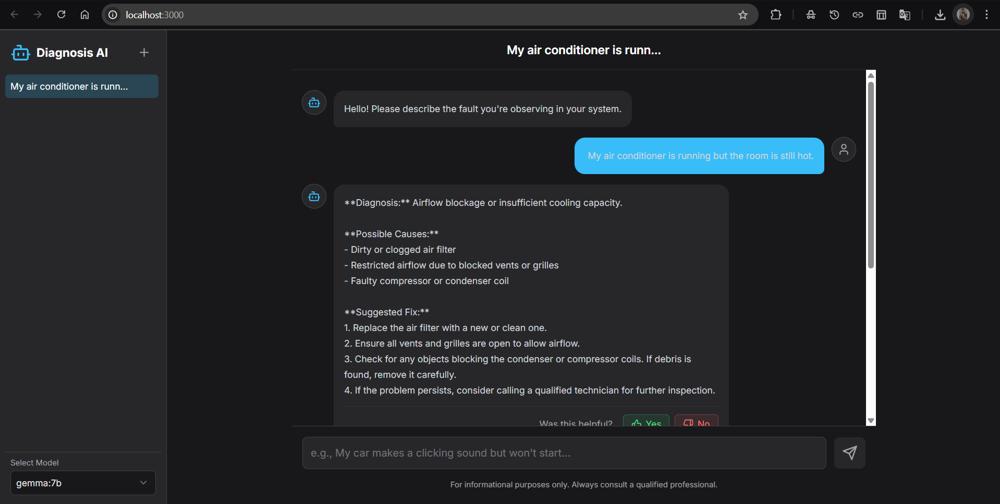

<<<<<<< HEAD
# AI Fault Diagnosis Agent

An intelligent, conversational AI agent designed to diagnose real-world system faults. This application leverages local large language models via Ollama to provide structured, actionable advice in a familiar, chat-based interface.


)


## 🎯 Why This Project Fits Xempla

This AI agent mirrors Xempla's mission: enabling autonomous systems to make and refine decisions in the field. It simulates a real-world diagnostic assistant with closed-loop feedback, using locally-run LLMs in a privacy-first setup — the kind of real-world AI deployment Xempla is known for.


## Features

- **Conversational Interface**: A modern, responsive chat interface for describing issues and receiving diagnoses.
- **Session History**: Your conversations are automatically saved per-session. You can create new chats, switch between them, and your history persists until the browser tab is closed.
- **History Management**:
    - **Rename**: Give your chats meaningful titles.
    - **Delete**: Remove conversations you no longer need.
    - **Share**: Easily copy an entire conversation to your clipboard in a formatted text block.
- **Dynamic Model Selection**: The app automatically detects which models you have installed in Ollama and populates the model selector, ensuring the list is always accurate.
- **Cancellable Responses**: A "Stop Generating" button appears during a response, allowing you to interrupt the AI and ask a new question immediately.
- **Streaming Output**: AI responses are streamed token-by-token for a real-time, responsive experience.

## Tech Stack

- **Frontend**: [React](https://reactjs.org/), [Vite](https://vitejs.dev/), [TypeScript](https://www.typescriptlang.org/)
- **Styling**: [Tailwind CSS](https://tailwindcss.com/)
- **AI Backend**: [Ollama](https://ollama.com/) (for running local LLMs)

## Prerequisites

Before you begin, ensure you have the following installed and running:

1.  **Node.js and npm**: Required for managing project dependencies and running the application. You can download it from [nodejs.org](https://nodejs.org/).
2.  **Ollama**: The application is powered by your local Ollama server. Follow the instructions at [ollama.com](https://ollama.com/) to install it.
3.  **AI Models**: You need to have the models you want to use pulled locally through Ollama. For example, to get the default model, run:
    ```bash
    ollama pull gemma:7b
    ```
    You can also pull other models like `llama3` or `mistral`.

## Important: Configure Ollama for Web UI

For the web application to communicate with your local Ollama server, you **must** configure Ollama to allow cross-origin requests from the app. This is a security measure browsers enforce, and not doing this will cause a "Failed to fetch" error.

**You only need to do this once.**

1.  **Set the `OLLAMA_ORIGINS` Environment Variable:**
    This tells Ollama to accept requests from the web app's address (`http://localhost:3000`).

    *   **On macOS or Linux:** Open your terminal and run the following commands. The first sets the variable, and the second restarts the server with the new setting.
        ```bash
        launchctl setenv OLLAMA_ORIGINS "http://localhost:3000"
        ollama serve
        ```
        For this setting to persist across reboots, you may need to add `launchctl setenv OLLAMA_ORIGINS "http://localhost:3000"` to your shell profile (e.g., `~/.zshrc`, `~/.bashrc`).

    *   **On Windows:** Open PowerShell **as an administrator** and run this command:
        ```powershell
        [System.Environment]::SetEnvironmentVariable('OLLAMA_ORIGINS', 'http://localhost:3000', [System.EnvironmentVariableTarget]::Machine)
        ```
        After running the command, you **must restart your computer** for the change to take full effect.

2.  **Verify the Configuration:** After restarting Ollama (or your computer on Windows), it will now accept requests from the web application, and the "Failed to fetch" error should be resolved.

## Getting Started

Follow these steps to get the application running on your local machine.

### 1. Configure Ollama
First, ensure you have configured Ollama to accept requests from the web UI by following the steps in the **"Important: Configure Ollama for Web UI"** section above. This is a required first step.

### 2. Install Dependencies
Navigate to the project directory in your terminal and install the required npm packages.

```bash
cd /path/to/your/project
npm install
```

### 3. Ensure Ollama is Running
Start your Ollama server if it's not already running. You can verify it's active by visiting `http://localhost:11434` in your browser, where you should see the message "Ollama is running".

### 4. Start the Application
Once dependencies are installed and Ollama is configured and running, run the start script:

```bash
npm start
```

This will launch the Vite development server. Your default browser should open to `http://localhost:3000`, and you can start using the AI Fault Diagnosis Agent.
=======
# AI-Fault-Diagnosis-Agent
>>>>>>> b6ed516beecaf4419cdaccec70612460a1b7d69e
